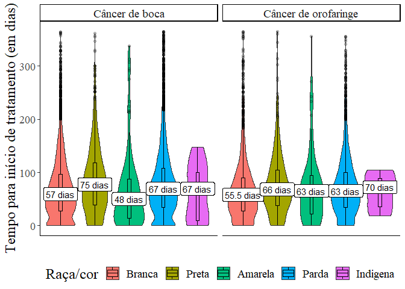

Desigualdades raciais no tempo para início do tratamento do câncer de
boca e orofaringe no Brasil, no período de 2013 a 2019
================
Márcio V de G Affonso
2022-11-28

Desenvolvido pelo Instituto Nacional de Câncer (INCA) o Integrador RHC –
Registro Hospitalar de Câncer é um sistema Web que consolida dados
hospitalares provenientes dos Registros Hospitalares de Câncer de todo o
Brasil.

Além da consulta na própria plataforma Web, o Integrador RHC permite o
download desses dados em formato `.dbf`. Com base nesses arquivos de
acesso público, este estudo buscou descrever o panorama epidemiológico
do câncer de boca no Brasil, no período de 2013 a 2019.

## Leitura e armazenamento dos arquivos `.dbf` em um único dataframe

Para o processo de leitura e armazenamento dos arquivos, utilizou-se o
pacote `foreign` juntamente de um `for loop`.

``` r
# Identificando os arquivos com padrão `.dbf` no diretório
arquivos <- list.files(pattern = ".dbf")

# Leitura dos arquivos e armazenamento em um dataframe com for loop
## Criação do dataframe vazio
dados <- data.frame() 

## For loop
for (file in arquivos) { 
  dados_dbf <- read.dbf(file)
  dados <- rbind(dados, dados_dbf)
}
```

## Seleção das variáveis de interesse

Haja vista que estão disponíveis mais de 40 variáveis para análise,
neste estudo selecionamos apenas 12, as quais estão identificadas
abaixo:

    ##  [1] "TPCASO"     "SEXO"       "IDADE"      "RACACOR"    "INSTRUC"   
    ##  [6] "ESTADRES"   "ANOPRIDI"   "DIAGANT"    "LOCTUDET"   "ESTADIAM"  
    ## [11] "DTDIAGNO"   "DATAINITRT"

## Processo de filtro inicial

É possível classificar os casos do RHC em analíticos e não-analíticos.
Os casos analíticos referem-se aos indivíduos que tiveram diagnóstico e
tratamento iniciados numa mesma unidade hospitalar, enquanto os casos
não analíticos referem-se àqueles que tiveram diagnóstico ou tratamento
iniciado em uma unidade hospitalar e, posteriormente, migraram para
outra unidade. Assim, a fim de evitar a duplicidade dos dados,
analisaremos aqui apenas os dados analíticos.

Além disso, considerando que avaliaremos apenas os indivíduos com Câncer
de Boca e Orofaringe, é necessário selecionar somente as observações que
contenham os códigos CID - Categoria 3 dígitos da Classificação
Internacional de Doença - C00 a C06; C09 e C10.

``` r
dados_of_cb <- dados_of %>% 
  filter(TPCASO == "1", # Filtrando os casos analíticos
         LOCTUDET %in% c("C00", "C01", "C02", "C03", "C04", "C05", "C06",
                         "C09", "C10"))
```

## Processo de manipulação dos dados

Para podermos visualizar, analisar e buscar insights nos dados, é
necessária a manipulação das variáveis, criando novas ou recodificando
aquelas que já existem no banco de dados.

- Abaixo podemos visualizar algumas alterações:
  - Remoção da variável TPCASO com a função `select`
  - Mudança do tipo das variáveis para character com a função `mutate`
  - Mudança de algumas variáveis para o formato Data, com a função
    `as.Date`
  - Mudança da variável IDADE para o formato numérico
  - Recodificação das variáveis ESTADIAM, LOCTUDET e INSTRUC com o
    `ifelse`
  - Criação da variável TIT, que representa o tempo para início de
    tratamento, com a função `difftime`

``` r
dados_of_cb <- dados_of_cb %>% 
  select(-TPCASO) %>% 
  mutate_all(as.character) %>% 
  mutate_at(vars(DTDIAGNO, DATAINITRT), as.Date, format = "%d/%m/%Y") %>% 
  mutate_at(vars(IDADE), as.numeric) %>% 
  mutate(ESTADIAM = ifelse(grepl("^1|2|II", ESTADIAM), "0", 
                           ifelse(grepl("^3|4|IV", ESTADIAM), "1", NA))) %>%
  mutate(LOCTUDET_2 = ifelse(LOCTUDET %in% c("C00", "C01", "C02", "C03", "C04", "C05", "C06"), "0", "1")) %>%
  mutate(INSTRUC = ifelse(INSTRUC %in% c("1", "2"), "0", 
                            ifelse(INSTRUC %in% c("3", "4", "5", "6"), "1", NA))) %>% 
  mutate(TIT = difftime(DATAINITRT, DTDIAGNO, units = c("days"))) %>% 
  mutate(TIT = as.numeric(TIT))
```

Ademais, entendendo a necessidade de unificar informações de diferentes
fontes, utilizamos também a função `full_join` e `left_join` para
acrescentar informações referentes à descrição do CID de cada neoplasia
e à localização geográfica dos casos.

``` r
# Incorporando um dataframe com dados das Unidades Federativas do Brasil com o pacote `geobr`
mapa_brasil <- read_state(code_state = "all", year = 2010)
```

    ## Using year 2010

``` r
## ´full_join` com o dataframe
dados_of_cb <- dados_of_cb %>% 
  full_join(mapa_brasil, by = c("ESTADRES" = "abbrev_state")) %>% 
  select(-code_state, -code_region)

# Incorporando um dataframe com a descrição dos CIDs, utilizado pelo DATASUS
categoria_cid <- read.csv2("CID-10-CATEGORIAS.csv") %>% select(CAT, DESCRICAO)

## corrigindo a codificação textual
Encoding(categoria_cid$DESCRICAO) <- "latin1"

## `left_join` com o dataframe
dados_of_cb <- dados_of_cb %>% 
  left_join(categoria_cid, by = c("LOCTUDET" = "CAT"))
```

A existência de valores faltantes (missings) também pode afetar a
análise dos dados. Observou-se a presença desses valores na variável
RACACOR, referente à raça/cor dos indivíduos. Assim, com a função
`replace_with_na`, foram substituídos os valores 9 por `NA`.

``` r
dados_of_cb <- dados_of_cb %>% 
  replace_with_na(replace = list(RACACOR = c(9,99), DIAGANT = c(9,99)))
```

Para viabilizar a interpretação dos dados, foram adicionados labels às
variáveis e às suas categorias.

``` r
dados_of_cb <- dados_of_cb %>% 
  set_value_labels(SEXO = c("Masculino" = "1", "Feminino" = "2"),
                   RACACOR = c("Branca" = "1", "Preta" = "2", "Amarela" = "3",
                               "Parda" = "4", "Indígena" = "5"),
                   DIAGANT = c("Sem diag/Sem trat" = "1", "Com diag/Sem trat" = "2",
                               "Com diag/Com trat" = "3", "outros" = "4"),
                   ESTADIAM = c("Inicial" = "0", "Avançado" = "1"),
                   INSTRUC = c("Menos de 8 anos de estudo" = "0", 
                                 "Mais de 9 anos de estudo" = "1"),
                   LOCTUDET_2 = c("Câncer de boca" = "0", "Câncer de orofaringe" = "1"))

## Adicionando labels às variáveis
var_label(dados_of_cb) <- list(IDADE = "Idade",
                               SEXO = "Sexo",
                               RACACOR = "Raça/cor",
                               ANOPRIDI = "Ano do diagnóstico",
                               DIAGANT = "Diagnóstico e tratamento prévios",
                               LOCTUDET = "Localização da lesão",
                               DTDIAGNO = "Data do diagnóstico",
                               DATAINITRT = "Data do início do tratamento",
                               DESCRICAO = "Neoplasia",
                               INSTRUC = "Escolaridade",
                               name_state = "Estado de residência",
                               name_region = "Região de residência",
                               ESTADIAM = "Estadiamento da lesão",
                               TIT = "Tempo para início do tratamento")
```

## Processo de filtro final

Após a manipulação e organização dos dados, aplicou-se o filtro na idade
dos indivíduos, no período em que os casos foram diagnosticados e
tratados e também no tempo para início do tratamento. A aplicação desses
filtros buscou evitar possíveis outliers que pudessem prejudicar a
análise dos dados.

``` r
dados_of_cb <- dados_of_cb %>% 
  filter(between(IDADE, 18, 100),
         DTDIAGNO >= c("2013-01-01"), 
         DTDIAGNO <= c("2019-12-31"),
         DATAINITRT >= c("2013-01-01"), 
         DATAINITRT <= c("2019-12-31"),
         DIAGANT %in% c("1","2")) %>%  
  filter(between(TIT, 0, 365))
```

## Sumarização dos resultados

Abaixo podemos observar uma tabela que sumariza os resultados.

    ## Rows: 42,179
    ## Columns: 17
    ## $ SEXO        <chr+lbl> "1", "1", "1", "1", "2", "1", "1", "1", "1", "1", "1",…
    ## $ IDADE       <dbl> 64, 63, 47, 64, 74, 72, 58, 63, 68, 56, 49, 57, 57, 55, 54…
    ## $ RACACOR     <chr+lbl> "1", "4", "1", "4", "4", "1", "4", "4", "2", "4", "4",…
    ## $ INSTRUC     <chr+lbl> NA, "1", "1", "1", "0", NA, "1", "1", "0", "1", "1", "…
    ## $ ESTADRES    <chr> "RJ", "PR", "PR", "PR", "PR", "PR", "PR", "PR", "PR", "PR"…
    ## $ ANOPRIDI    <chr> "2013", "2013", "2013", "2013", "2013", "2013", "2013", "2…
    ## $ DIAGANT     <chr+lbl> "2", "2", "2", "1", "1", "1", "1", "1", "2", "1", "1",…
    ## $ LOCTUDET    <chr> "C02", "C10", "C10", "C00", "C10", "C02", "C10", "C10", "C…
    ## $ ESTADIAM    <chr+lbl> "1", NA, NA, "0", NA, "0", NA, NA, NA, NA, "0", NA, "0…
    ## $ DTDIAGNO    <date> 2013-08-07, 2013-01-04, 2013-01-08, 2013-01-08, 2013-03-0…
    ## $ DATAINITRT  <date> 2013-11-14, 2013-02-13, 2013-04-09, 2013-03-22, 2013-04-1…
    ## $ LOCTUDET_2  <chr+lbl> "0", "1", "1", "0", "1", "0", "1", "1", "1", "1", "0",…
    ## $ TIT         <dbl> 99, 40, 91, 73, 42, 25, 38, 41, 56, 0, 28, 0, 0, 25, 47, 5…
    ## $ name_state  <chr> "Rio De Janeiro", "Paraná", "Paraná", "Paraná", "Paraná", …
    ## $ name_region <chr> "Sudeste", "Sul", "Sul", "Sul", "Sul", "Sul", "Sul", "Sul"…
    ## $ geom        <MULTIPOLYGON [°]> MULTIPOLYGON (((-41.85946 -..., MULTIPOLYGON …
    ## $ DESCRICAO   <chr> "Neoplasia maligna de outras partes e de partes não especi…

| **Characteristic**                                                         | **Câncer de boca**, N = 29,933 | **Câncer de orofaringe**, N = 12,246 |
|:---------------------------------------------------------------------------|:------------------------------:|:------------------------------------:|
| Sexo                                                                       |                                |                                      |
| Masculino                                                                  |          22,754 (76%)          |             10,273 (84%)             |
| Feminino                                                                   |          7,179 (24%)           |             1,973 (16%)              |
| Idade                                                                      |          60 (53, 68)           |             58 (52, 65)              |
| Raça/cor                                                                   |                                |                                      |
| Branca                                                                     |          8,048 (42%)           |             3,378 (42%)              |
| Preta                                                                      |          1,334 (7.0%)          |              613 (7.6%)              |
| Amarela                                                                    |           129 (0.7%)           |              62 (0.8%)               |
| Parda                                                                      |          9,454 (50%)           |             4,014 (50%)              |
| Indígena                                                                   |          16 (\<0.1%)           |              6 (\<0.1%)              |
| Unknown                                                                    |             10,952             |                4,173                 |
| Escolaridade                                                               |                                |                                      |
| Menos de 8 anos de estudo                                                  |          14,908 (61%)          |             5,732 (58%)              |
| Mais de 9 anos de estudo                                                   |          9,630 (39%)           |             4,171 (42%)              |
| Unknown                                                                    |             5,395              |                2,343                 |
| Estado de residência                                                       |                                |                                      |
| Acre                                                                       |          26 (\<0.1%)           |              17 (0.1%)               |
| Alagoas                                                                    |           420 (1.4%)           |              139 (1.1%)              |
| Amapá                                                                      |          28 (\<0.1%)           |              20 (0.2%)               |
| Amazonas                                                                   |           171 (0.6%)           |              96 (0.8%)               |
| Bahia                                                                      |          1,532 (5.1%)          |              744 (6.1%)              |
| Ceará                                                                      |          1,082 (3.6%)          |              366 (3.0%)              |
| Distrito Federal                                                           |           133 (0.4%)           |              75 (0.6%)               |
| Espirito Santo                                                             |           929 (3.1%)           |              413 (3.4%)              |
| Goiás                                                                      |           169 (0.6%)           |              61 (0.5%)               |
| Maranhão                                                                   |           406 (1.4%)           |              149 (1.2%)              |
| Mato Grosso                                                                |           309 (1.0%)           |              166 (1.4%)              |
| Mato Grosso Do Sul                                                         |           289 (1.0%)           |              128 (1.0%)              |
| Minas Gerais                                                               |          4,651 (16%)           |             1,976 (16%)              |
| Pará                                                                       |           419 (1.4%)           |              117 (1.0%)              |
| Paraíba                                                                    |           834 (2.8%)           |              276 (2.3%)              |
| Paraná                                                                     |          2,178 (7.3%)          |              765 (6.3%)              |
| Pernambuco                                                                 |          1,305 (4.4%)          |              420 (3.4%)              |
| Piauí                                                                      |           322 (1.1%)           |              104 (0.9%)              |
| Rio De Janeiro                                                             |          1,652 (5.5%)          |              764 (6.3%)              |
| Rio Grande Do Norte                                                        |           402 (1.3%)           |              181 (1.5%)              |
| Rio Grande Do Sul                                                          |          1,772 (5.9%)          |             1,007 (8.3%)             |
| Rondônia                                                                   |           165 (0.6%)           |              84 (0.7%)               |
| Roraima                                                                    |          10 (\<0.1%)           |             12 (\<0.1%)              |
| Santa Catarina                                                             |          1,037 (3.5%)          |              558 (4.6%)              |
| São Paulo                                                                  |          9,225 (31%)           |             3,433 (28%)              |
| Sergipe                                                                    |           213 (0.7%)           |              52 (0.4%)               |
| Tocantins                                                                  |           160 (0.5%)           |              79 (0.6%)               |
| Unknown                                                                    |               94               |                  44                  |
| Região de residência                                                       |                                |                                      |
| Centro Oeste                                                               |           900 (3.0%)           |              430 (3.5%)              |
| Nordeste                                                                   |          6,516 (22%)           |             2,431 (20%)              |
| Norte                                                                      |           979 (3.3%)           |              425 (3.5%)              |
| Sudeste                                                                    |          16,457 (55%)          |             6,586 (54%)              |
| Sul                                                                        |          4,987 (17%)           |             2,330 (19%)              |
| Unknown                                                                    |               94               |                  44                  |
| Neoplasia                                                                  |                                |                                      |
| Neoplasia maligna da amígdala                                              |             0 (0%)             |             3,658 (30%)              |
| Neoplasia maligna da base da língua                                        |          5,239 (18%)           |                0 (0%)                |
| Neoplasia maligna da gengiva                                               |           943 (3.2%)           |                0 (0%)                |
| Neoplasia maligna da orofaringe                                            |             0 (0%)             |             8,588 (70%)              |
| Neoplasia maligna de outras partes e de partes não especificadas da boca   |          4,519 (15%)           |                0 (0%)                |
| Neoplasia maligna de outras partes e de partes não especificadas da língua |          8,581 (29%)           |                0 (0%)                |
| Neoplasia maligna do assoalho da boca                                      |          3,844 (13%)           |                0 (0%)                |
| Neoplasia maligna do lábio                                                 |          2,514 (8.4%)          |                0 (0%)                |
| Neoplasia maligna do palato                                                |          4,293 (14%)           |                0 (0%)                |
| Estadiamento da lesão                                                      |                                |                                      |
| Inicial                                                                    |          6,393 (28%)           |              980 (12%)               |
| Avançado                                                                   |          16,644 (72%)          |             7,053 (88%)              |
| Unknown                                                                    |             6,896              |                4,213                 |
| Tempo para início do tratamento                                            |          65 (32, 107)          |             62 (33, 99)              |

## Tempo para início de tratamento de acordo com a Raça/Cor

Para identificar se houve diferença no tempo para início de tratamento
entre as diferentes categorias da variável Raça/Cor, foi utilizado o
teste de Kruskal-Wallis, devido à distribuição não normal dos dados,
seguido pelo pós-teste de Dunn. Os resultados podem ser observados
abaixo.

<!-- -->

O teste de kruskal-wallis confirma que há diferença estatisticamente
significante, como pode ser observado abaixo.

``` r
## Kruskal-wallis
dados_of_cb %>% 
  group_by(LOCTUDET_2) %>% 
  kruskal_test(TIT ~ RACACOR)
```

    ## # A tibble: 2 × 7
    ##   LOCTUDET_2               .y.       n statistic    df        p method        
    ## * <chr+lbl>                <chr> <int>     <dbl> <int>    <dbl> <chr>         
    ## 1 0 [Câncer de boca]       TIT   29933     161.      4 9.83e-34 Kruskal-Wallis
    ## 2 1 [Câncer de orofaringe] TIT   12246      56.9     4 1.33e-11 Kruskal-Wallis

``` r
### Pós teste
dados_of_cb %>% 
  group_by(LOCTUDET_2) %>% 
  dunn_test(TIT ~ RACACOR, p.adjust.method = 'bonferroni')
```

    ## # A tibble: 20 × 10
    ##    LOCTUDET_2  .y.   group1 group2    n1    n2 stati…¹        p    p.adj p.adj…²
    ##  * <chr+lbl>   <chr> <chr>  <chr>  <int> <int>   <dbl>    <dbl>    <dbl> <chr>  
    ##  1 0 [Câncer … TIT   1      2       8048  1334  9.14   6.12e-20 6.12e-19 ****   
    ##  2 0 [Câncer … TIT   1      3       8048   129 -1.93   5.34e- 2 5.34e- 1 ns     
    ##  3 0 [Câncer … TIT   1      4       8048  9454 10.4    1.89e-25 1.89e-24 ****   
    ##  4 0 [Câncer … TIT   1      5       8048    16 -0.260  7.95e- 1 1   e+ 0 ns     
    ##  5 0 [Câncer … TIT   2      3       1334   129 -4.79   1.66e- 6 1.66e- 5 ****   
    ##  6 0 [Câncer … TIT   2      4       1334  9454 -3.83   1.26e- 4 1.26e- 3 **     
    ##  7 0 [Câncer … TIT   2      5       1334    16 -1.33   1.83e- 1 1   e+ 0 ns     
    ##  8 0 [Câncer … TIT   3      4        129  9454  3.72   2.01e- 4 2.01e- 3 **     
    ##  9 0 [Câncer … TIT   3      5        129    16  0.402  6.88e- 1 1   e+ 0 ns     
    ## 10 0 [Câncer … TIT   4      5       9454    16 -0.892  3.73e- 1 1   e+ 0 ns     
    ## 11 1 [Câncer … TIT   1      2       3378   613  5.06   4.30e- 7 4.30e- 6 ****   
    ## 12 1 [Câncer … TIT   1      3       3378    62  0.373  7.09e- 1 1   e+ 0 ns     
    ## 13 1 [Câncer … TIT   1      4       3378  4014  6.80   1.02e-11 1.02e-10 ****   
    ## 14 1 [Câncer … TIT   1      5       3378     6  0.300  7.64e- 1 1   e+ 0 ns     
    ## 15 1 [Câncer … TIT   2      3        613    62 -1.31   1.91e- 1 1   e+ 0 ns     
    ## 16 1 [Câncer … TIT   2      4        613  4014 -1.45   1.46e- 1 1   e+ 0 ns     
    ## 17 1 [Câncer … TIT   2      5        613     6 -0.243  8.08e- 1 1   e+ 0 ns     
    ## 18 1 [Câncer … TIT   3      4         62  4014  0.868  3.86e- 1 1   e+ 0 ns     
    ## 19 1 [Câncer … TIT   3      5         62     6  0.175  8.61e- 1 1   e+ 0 ns     
    ## 20 1 [Câncer … TIT   4      5       4014     6 -0.0891 9.29e- 1 1   e+ 0 ns     
    ## # … with abbreviated variable names ¹​statistic, ²​p.adj.signif

## Conclusão

Os resultados nos indicam que indivíduos considerados pretos e pardos
demoraram mais tempo para iniciarem seus respectivos tratamentos
oncológicos. Aspectos relacionados aos Determinantes Sociais da Saúde,
especialmente status socioeconômico, escolaridade e a própria raça/cor,
influenciam também no acesso e na utilização dos serviços de saúde. Este
estudo invoca a necessidade de aprofundamento nesses dados, buscando
traçar com mais precisão o perfil dos indivíduos que estão mais
suscetíveis e vulneráveis a essas condições.
